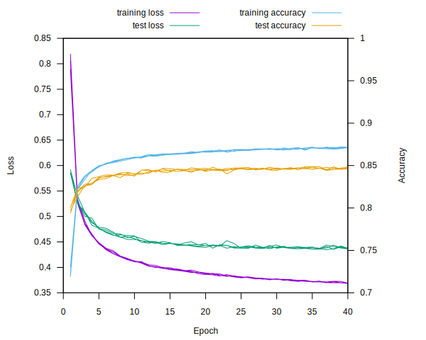
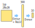
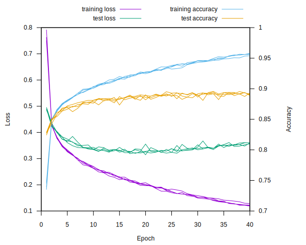
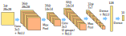
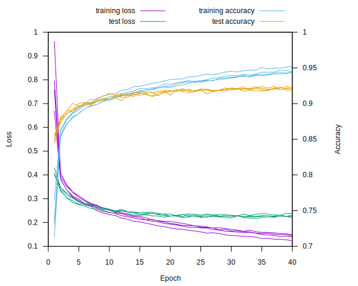

# fashion_mnist example

This example trains a few a different network types on the [Fashion-MNIST dataset](https://github.com/zalandoresearch/fashion-mnist).
The example also implements an anti-aliased variant of max pooling as described in [Making Convolutional Networks Shift-Invariant Again by Richard Zhang](https://richzhang.github.io/antialiased-cnns/) for improved accuracy.

## Overview

The dataset consists of 60000 training images and 10000 test images.  Each image is 28 by 28 greyscale, and has a corresponding label between 0 and 9 (signifying which of the 10 categories the image belongs to).

The example trains a network for multiple epochs (each epoch covers the entire training set in some shuffled order), testing accuracy against the full test set after each one.

## Running The Example

First run `download.sh` in `data/fashion_mnist` to download the dataset, or download the gz files manually.  Then the example can be run using:

```
cargo run --release --example fashion_mnist
```

This will train a CNN by default.  Other networks can be trained by passing different command-line arguments, run the following to show commandline help:

```
cargo run --release --example fashion_mnist -- --help
```

## Networks

The [Fashion-MNIST dataset](https://github.com/zalandoresearch/fashion-mnist) contains 28x28 greyscale images that are labelled with 1 of 10 categories.  It is considered to be a more challenging dataset than the original [MNIST data](http://yann.lecun.com/exdb/mnist/) of handwritten digits.

### Linear Classifier

This network can be trained by passing `linear` as the network type:

```
cargo run --release --example fashion_mnist -- linear
```

This network has no hidden layers or activation functions, just a single dense layer from 784 pixels to 10 categories.  Softmax is then used to convert the final values into a probability for each category.


Training 4 different random starting conditions for 40 epochs produces the following statistics:



Training accuracy creeps up to 87%, but does not seem to generalize well since test accuracy quickly tops out just short of 85%.

### Single Hidden Layer

This network can be trained by passing `single-layer` as the network type:

```
cargo run --release --example fashion_mnist -- single-layer
```

This network adds a single hidden layer with 300 units and a (leaky) ReLU activation function:



Repeating the same experiment with 4 random starting conditions for 40 epochs produces the following:



Accuracy on the test set is up to 89%, but we very quickly start overfitting to the training set (the loss function on the test set starts to increase after only 20 epochs).

### Convolutional Neural Network

This network can be trained by passing `conv-net` as the network type (the default if no network is provided):

```
cargo run --release --example fashion_mnist -- conv-net
```

This network performs two rounds of 3x3 convolutions, with a ReLU activation and 2x2 max pooling after each one.



To make the network slightly smaller, the second convolution is split into 2 groups, with the first 16 output channels reading from the first 8 input channels, and the second 16 output channels reading from the second 8 input channels.

Training this for 40 epochs produces the following results:



Test accuracy is now up to 92%, which seems to be fairly respectable for a small network.  However, the network is still not generalising very well to the test set since test performance levels out while the training performance is still rising.

### Convolutional Neural Network With Anti-Aliasing

This network can be trained by passing `conv-blur-net` as the network type:

```
cargo run --release --example fashion_mnist -- conv-blur-net
```

This network is identical to the CNN above, except max pooling is replaced with an anti-aliased alternative, as described in [Making Convolutional Networks Shift-Invariant Again by Richard Zhang](https://richzhang.github.io/antialiased-cnns/).

Specifically we replace both of the previous max pool steps (that use size=2, stride=2) with two steps:

- Max pool (size=2, stride=1)
- Convolution with fixed weight 3x3 blur (stride=2, pad=1)

This has the effect of smoothing out the response of max pool as features shift from pixel to pixel, so should produce a result that is more robust.
The convolution weights are not trainable, so this does not add any parameters to the model.
Back-propagation through the extra convolution step does add to the training time however.

Training this for 40 epochs produces the following:


This seems to confirm the results of the paper: test accuracy has increased slightly to 92.5% and there is less of a gap between the training set and test set performance, indicating that the model has generalised more effectively.
