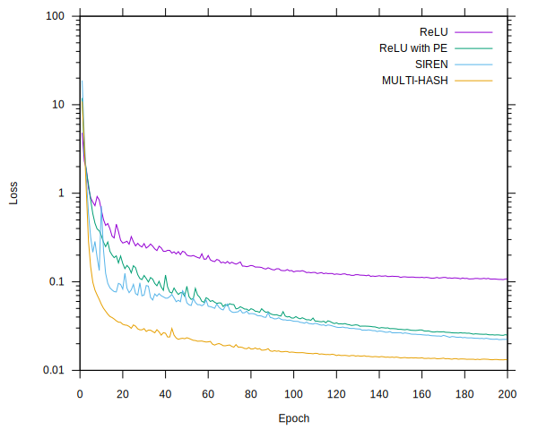
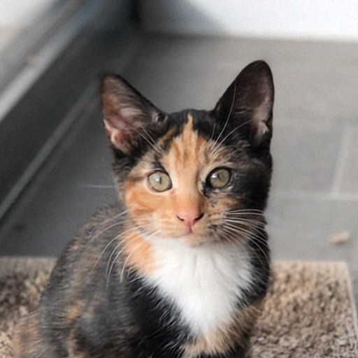

# image_fit example

This example overfits a few different networks to the following test image:


## Overview

The networks are:

- **ReLU**: 2D coordinate into a 256-128-64-32 MLP with ReLU activation after each layer
- **ReLU-PE**: 2D positional encoding (L=8 so 32 values) into the same MLP as above
- **SIREN**: 2D coordinate into a 256-128-64-32 MLP with sine activation after each layer
  - This is implemented as described in [Implicit Neural Representations with Periodic Activation Functions](https://vsitzmann.github.io/siren/), using the initialisation scheme from the paper (including the extra scaling on the first layer).
- **MULTI-HASH**: 2D coordinate into 10-level hash encoding (up to 4096 entries per level, 2 values per entry) with concatenated outputs fed into a 64-64 MLP with ReLU activation after each layer
  - This is implemented as described in [Instant Neural Graphics Primitives with a Multiresolution Hash Encoding](https://github.com/NVlabs/instant-ngp), using smaller hash tables and number of layers, in order to train a similar number of parameters to the other networks.

For all networks there is then a final linear layer to an RGB triple.  Here is a graph of how the training loss evolves over 200 epochs of training:



The loss function is squared difference between the RGB values of the result and the training image.
Although the SIREN network evolves similarly to the ReLU-PE network, the SIREN network seems to do better at capturing sharp features, and does so with fewer parameters (due to the lack of initial encoding layer).

The MULTI-HASH network trains quickly and has the lowest error by far amongst these networks.

The number of trainable parameters for each network is as follows:

Network Type | Trainable Parameters
--- | ---
ReLU | 44099
ReLU with PE | 51779
SIREN | 44099
MULTI-HASH | 43977

## Running The Example

The example can be run using:

```
cargo run --release --example image_fit
```

This will fit using a SIREN network by default.  Other networks can be trained by passing different command-line arguments, run the following to show commandline help:

```
cargo run --release --example image_fit -- --help
```

## Fitted Image Results

Here are the results for each network type after 200 epochs of training.  Each epoch trains using the same number of pixels as the input image, in mini-batches of 16K randomly sampled pixels.

### ReLU


### ReLU with Positional Encoding


### SIREN



### MULTI-HASH


